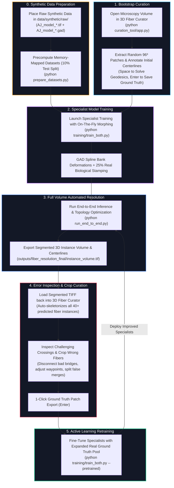
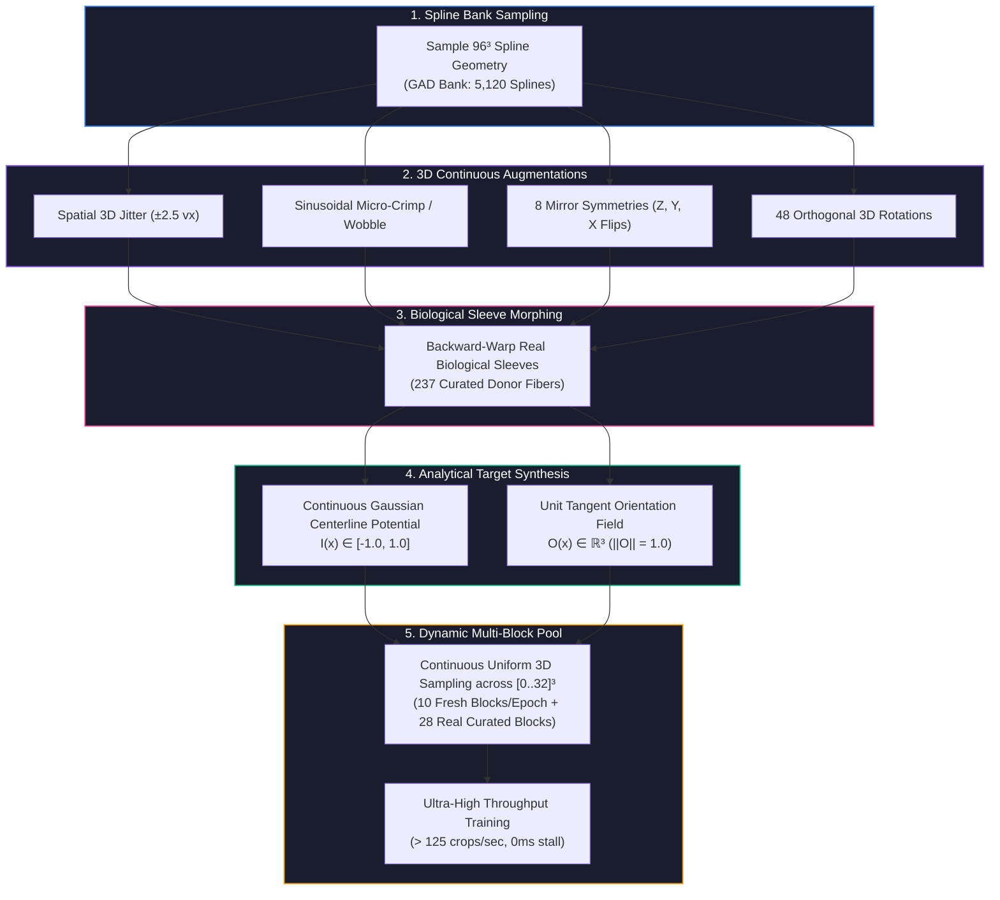
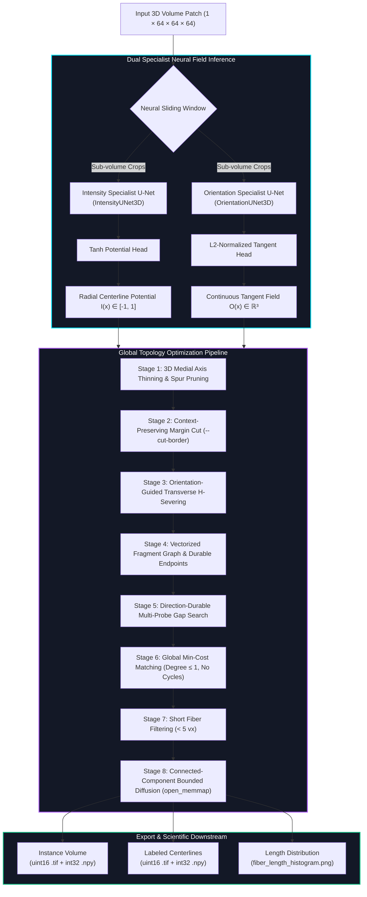
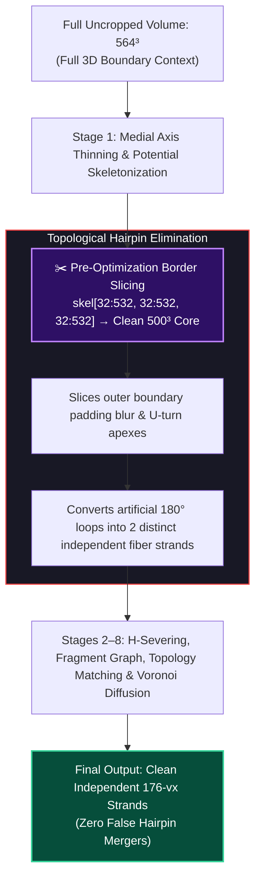

# 3D Fiber Resolution, Dual Neural Field & Topology Optimization Framework

A complete deep learning and geometric graph optimization framework for high-resolution 3D fiber microstructure segmentation, centerline extraction, transverse $H$-junction severing, and crossing resolution in dense biomaterials and micro-CT tomography volumes (collagen networks, fibrous composites, Altendorf-Jeulin stochastic models).

---

## ⚡ Quick Start (Zero-Flag Execution)

Run the full pipeline out-of-the-box with default auto-discovery and sensible hyperparameters:

```bash
# 1. Place raw synthetic models into raw_data/ & precompute datasets (default 10% test split):
# 1. Place raw synthetic models into data/synthetic/raw/ & precompute datasets:
python prepare_datasets.py

# 2. Start Interactive 3D Fiber Curator (Annotate initial patches or fix/crop segmented instances)
# 2. Start Interactive 3D Fiber Curator (Annotate initial patches from data/fibers_to_segment/)
python curation_tool/app.py

# 3. Train Specialist Models (On-the-fly biological spline morphing, 50 epochs, 25% real patch stamping)
# 3. Train Specialist Models (On-the-fly biological spline morphing, 50 epochs)
python training/train_both.py

# 4. Sliding-Window Neural Inference (Auto-grabs first volume in process_data/, saves to outputs/fiber_*.npy)
# 4. Sliding-Window Neural Inference (Auto-grabs volume in data/fibers_to_segment/, outputs to outputs/)
python inference/run_inference.py

# 5. Global Topology Optimization (Direct degree-1 matching, 32px border severing, min-fiber-length 5)
# 5. Global Topology Optimization (Direct degree-1 matching, 32px border severing)
python inference/run_topology_optimization.py

# OR 1-Click Master End-to-End Resolution:
python run_end_to_end.py
```

---

## 🔄 Iterative Active Learning & Retraining Workflow

The framework is designed around a closed-loop **Active Learning Flywheel**: rather than manually annotating thousands of dense 3D voxels from scratch, you rapidly bootstrap from precomputed synthetic data, inspect, crop errors from segmented outputs, and incrementally retrain:



### Step-by-Step Workflow & Retraining Loop:

1. **Place Raw Synthetic Data into `data/synthetic/raw/` & Run Precomputation**:
   - Place your raw Altendorf-Jeulin synthetic volume and geometry files (`AJ_model_1.tif` .. `AJ_model_10.tif` and `AJ_model_1.gad` .. `AJ_model_10.gad`) into `data/synthetic/raw/`.
   - Run `python prepare_datasets.py` to precompute memory-mapped continuous potential ($I \in [-1, 1]$) and unit orientation tangent fields ($\vec{O} \in \mathbb{R}^3$). By default, **10% of the raw models are split into `data/synthetic/precomputed/test/`** for test evaluation, while **90% are stored in `data/synthetic/precomputed/train/`** for training.

2. **Segment Initial Random Patches**:
   - Drop your microscopy volume into `data/fibers_to_segment/`.
   - Launch the Fiber Curator (`python curation_tool/app.py`).
   - Click **`🎲 Random 96³`** to sample dense regions. Trace a few clean fiber strands using interactive seed pins.
   - Press **`Space`** to compute continuous geodesic paths, then press **`Enter`** to save clean ground truth triplets into `data/curated/patches/`.

3. **Launch Initial Specialist Training**:
   - Run `python training/train_both.py` to train both `IntensityUNet3D` and `OrientationUNet3D`.
   - On-the-fly spline morphing mathematically deforms your curated donor fibers onto thousands of synthetic trajectories with a 25% patch stamping rate, producing robust models from minimal manual data. Checkpoints save to `checkpoints/`.

4. **Infer & Optimize Full Volumes**:
   - Run `python run_end_to_end.py` to generate the complete 3D segmented instance stack (`outputs/fiber_resolution_final/instance_volume.tif`).

5. **Crop & Fix Erroneous Fibers from Segmented Results**:
   - Open `instance_volume.tif` directly in the Fiber Curator.
   - The tool instantly skeletonizes all segmented labels in 3D.
   - Locate any false merges, over-connected rungs, or broken segments. Delete erroneous fiber centerlines, crop out bad bridges, and fix difficult crossings.
   - Press **`Enter`** to save the corrected sub-volumes as high-value "hard negative / hard positive" training samples into `data/curated/patches/`.

6. **Iterative Retraining**:
   - Retrain your specialists warm-started from the previous checkpoints:
     ```bash
     python training/train_both.py --pretrained
     ```
   - Each iteration progressively eliminates edge cases and reinforces accurate topology at complex multi-fiber junctions.

---

## 💻 Command Reference & Usage Guide

### 1. Place Raw Synthetic Data in `data/synthetic/raw/` & Run Precomputation
Place raw synthetic files (`AJ_model_*.tif` and `AJ_model_*.gad`) into `data/synthetic/raw/`, then precompute analytical ground-truth orientation and signed probability fields into memory-mapped NPY format with a default **10% test split**:

```bash
# Precompute datasets (splits 10% into test and 90% into train by default):
python prepare_datasets.py

# Optional: Custom test split fraction or force overwrite:
python prepare_datasets.py --test-split 0.10 --overwrite
```

---

### 2. Interactive 3D Fiber Curator Web App
Start the WebGL Three.js annotation server to inspect volumes, load segmented instances, fix wiring, and curate real training samples:

```bash
python curation_tool/app.py
```
Open **[http://127.0.0.1:5000](http://127.0.0.1:5000)** in your web browser:
1. Click **`📁 Upload Volume`** in the top navbar to select any `.tif`, `.tiff`, or `.npy` file from your PC (or simply drag-and-drop the file directly onto the browser window, or click **`📂 Presets`**).
2. Select any segmented TIFF (e.g. `outputs/instance_volume.tif`) or raw microscopy volume.
3. The engine automatically runs 3D skeletonization across all segmented fibers in the 96³ cube, extracts endpoints & waypoints, and renders all 40+ 3D fiber tracks.
4. **Orient with 3D Coordinate Arrows**: Use the 3D scene coordinate arrows anchored directly next to the cube origin (Red: +X width, Green: +Y height, Cyan: +Z depth) that orbit with natural 3D depth and perspective.
5. **Fix wiring**: Select a fiber ID, adjust or add/delete waypoints, split false mergers, or reconnect broken fibers.
6. Press **`Space`** to re-resolve geodesic continuous paths and inspect updated 3D centerlines.
7. Press **`Enter`** to save the curated 96³ patch directly into `data/curated/patches/`.

---

### 3. Train Specialist Models (On-The-Fly Morphing)
Default settings automatically use 10-block/epoch dynamic biological morphing, 50 epochs, 64³ patch size, and batch size 4:

```bash
# 1-Command: Train both specialists with full biological morphing
python training/train_both.py

# Train individual specialists standalone:
python training/train_intensity.py
python training/train_orientation.py

# Optional: Train on ONLY real curated patches (no synthetic data)
python training/train_both.py --real-only --train-on-all-data --pretrained
```

---

### 4. Run Sliding-Window Inference
Generates continuous potential and tangent fields from your microscopy volume (auto-detected as first file in `data/fibers_to_segment/` and saved to `outputs/fiber_intensity.npy`, `outputs/fiber_orientation.npy`):

```bash
# 1-Command: Run both Intensity & Orientation specialists
python inference/run_inference.py

# Optional overrides:
python inference/run_inference.py --input data/fibers_to_segment/sample.tif --output-prefix outputs/custom_run
```

---

### 5. Run Topology Optimization Standalone
Optimizes topology directly from precomputed neural fields (auto-detects the volume from `data/fibers_to_segment/` and neural fields from `outputs/`) using **direct whole-volume degree-1 linear assignment matching** (32px boundary loop severing, <5 vx short fiber filtering, and connected-component bounded Voronoi diffusion without empty-voxel bleed):

```bash
# 1-Command: Run global topology optimization on default volume from data/fibers_to_segment/
python inference/run_topology_optimization.py

# Optional: Chunked mode with overlap consensus for multi-gigavoxel volumes
python inference/run_topology_optimization.py --mode chunked --chunk-size 512 --overlap 256
```

#### Output Artifacts:
- `instance_volume.tif`: 16-bit compressed TIFF stack of segmented 3D fiber instances.
- `instance_skeleton.tif`: 16-bit compressed TIFF stack of labeled 1-voxel mathematical centerlines.
- `instance_volume.npy` & `instance_skeleton.npy`: Memory-mapped int32 NumPy volumes for rapid downstream analysis.
- `fiber_length_histogram.png`: Global fiber length distribution plot.

---

### 6. 1-Click End-to-End Master Resolution
Runs GPU neural inference on raw microscopy and executes full topology optimization in a single command:

```bash
python run_end_to_end.py
```

---

## 📑 Deep-Dive & Architecture Table of Contents

- [Core Principles & Decoupled Neural Fields](#core-principles--decoupled-neural-fields)
- [On-The-Fly Dynamic Spline Morphing & Augmentation Engine](#on-the-fly-dynamic-spline-morphing--augmentation-engine)
- [Framework Architecture](#framework-architecture)
- [Topology Optimization Formulation](#topology-optimization-formulation)
- [Why H-Junctions Occur and How They Are Resolved](#why-h-junctions-occur-and-how-they-are-resolved)
- [Border Margin Trimming & Boundary Hairpin Elimination (`--cut-border`)](#border-margin-trimming--boundary-hairpin-elimination---cut-border)
- [Interactive 3D Fiber Curator Web App & Engine](#interactive-3d-fiber-curator-web-app--engine)
- [Export Formats (Memory-Mapped NPY & 16-bit TIFF)](#export-formats-memory-mapped-npy--16-bit-tiff)
- [Directory Structure](#directory-structure)
- [Disclosure & AI Assistance](#disclosure--ai-assistance)

---

## 💡 Core Principles & Decoupled Neural Fields

Rather than predicting fragile 1-voxel binary masks that coalesce touching fibers, this system decouples fiber segmentation into two specialist neural fields:

1. **3D Continuous Radial Intensity Potential Field $I(\vec{x}) \in [-1.0, 1.0]$**:
   - Peaks at $+1.0$ on the exact 1-voxel mathematical centerline $\mathcal{C}$.
   - Decays smoothly with Gaussian profile $G(\vec{x}) = \exp(-d(\vec{x}, \mathcal{C})^2 / 2\sigma^2)$.
   - Dips to negative values ($-1.0$) at multi-fiber crossing interfaces to force topological disconnectivity.
2. **3D Continuous Unit Tangent Field $\vec{O}(\vec{x}) = (V_z, V_y, V_x)$ ($\|\vec{O}\| = 1.0$)**:
   - Predicts the unit orientation tangent vector at every foreground voxel.

---

## 🧬 On-The-Fly Dynamic Spline Morphing & Augmentation Engine

To eliminate the synthetic-to-real domain gap without requiring thousands of manually labeled voxels, the pipeline dynamically deforms real biological donor fibers onto continuous 3D mathematical splines on-the-fly:



### Key Technical Innovations:
- **Sub-Voxel Centroid Auto-Centering (`_center_curve_to_mask`)**: Eliminates discrete Dijkstra corner-cutting drift across all 14 curated real patches (reduced from $1.26\text{ vx} \to 0.66\text{ vx}$ noise floor).
- **Continuous Segment Projection (`project_points_onto_curve_continuous`)**: Fully vectorized NumPy projection onto continuous 3D segments rather than discrete integer nodes.
- **Geodesic Candidate Selection (`get_candidate_voxels_fast`)**: Spherical geodesic dilation along 1D paths delivers a **200x speedup** for 3D deformation.

---

## 🧠 Framework Architecture



---

## 📐 Topology Optimization Formulation

A good fiber satisfies:
- **Maximized continuous length**: $-\lambda_\ell \cdot N$
- **Low curvature**: $+\lambda_\kappa \cdot \bar{\kappa}$
- **No sharp bends**: flat penalty for any junction kink $> 55^\circ$
- **No branching**: every fragment endpoint connects to at most ONE partner (degree $\le 1$)

### Objective Function:
$$\min_{\mathcal{B}} \sum_{b \in \mathcal{B}} \left( w_g \cdot d_{\text{gap}}(b) + w_\theta \arccos|\vec{O}_A \cdot \vec{O}_B| + \mathcal{P}_{\text{durable}}(b) \right)$$

Subject to:
1. **Degree Constraint**: $\operatorname{deg}(v) \le 1$ for all fragment endpoints $v$.
2. **No-Cycle Constraint**: Graph contains no closed loops.

---

## 🔬 Why H-Junctions Occur and How They Are Resolved

### The Topological Cause (Thinning of 3D Crossing Volumes):
In continuous 3D space, ground-truth centerlines are simple, non-branching 1D curves. However, fibers have finite physical thickness. When two fibers cross or touch ($d < r_1 + r_2$), their voxelized cylinders merge into a 3D convex intersection solid (diamond). During discrete 3D thinning (e.g. Lee-Kashyap skeletonization on cubic grids), a 4-way ($X$) intersection point is topologically unstable. Thinning naturally collapses the diamond into **two 3-way ($Y$) branching nodes joined by a short transverse $H$-rung**.

### Prevention via Smart Separable Stamping:
In the data augmentation pipeline ([`core/dataset.py`](core/dataset.py)), we enforce a **Centerline Separability Clearance Criterion**:
- A candidate fiber stamp is accepted **only if its centerline maintains $\ge 6.0\text{ voxels}$ distance** from all existing fiber centerlines.
- **Why 6 voxels?** With a $\sigma = 1.0$ Gaussian centerline profile ($I = +1.0$) and a $\sigma_{\text{cross}} = 1.5$ negative intersection dip ($I = -0.5$), a 6-voxel separation guarantees that the two positive centerline peaks remain distinct and separated by a negative energy valley, preventing synthetic $H$-junction formation.

### Resolution in Topology Optimization:
1. **Orientation-Guided Severing** ([`topology_optimizer/step1_sever_h_junctions.py`](topology_optimizer/step1_sever_h_junctions.py)):
   If a short branch ($L \le 14\text{ vx}$) has a geometric direction perpendicular ($> 60^\circ$) to its adjacent fiber trunks:
   $$\text{Perpendicularity} = 1 - |\vec{D}_{\text{rung}} \cdot \vec{O}_{\text{trunk}}| > 0.50 \implies \text{SEVER}$$
2. **Durable Endpoint Averaging** ([`topology_optimizer/step3_build_fragment_graph.py`](topology_optimizer/step3_build_fragment_graph.py)):
   Instead of using distorted skeleton voxels at the cut interface, we average $\vec{O}(\vec{x})$ over the **nearest 5 voxels back into the fragment body**.
3. **Collinear Continuation & Matching** ([`topology_optimizer/step2_bridge_gaps.py`](topology_optimizer/step2_bridge_gaps.py), [`topology_optimizer/step4_optimize_topology.py`](topology_optimizer/step4_optimize_topology.py)):
   Candidate pairs across the 1–2 voxel intersection gap with high mutual collinearity ($|\vec{O}_A \cdot \vec{O}_B| \ge 0.65$) are stitched straight through under degree $\le 1$ constraints.

---

## ✂️ Border Margin Trimming & Boundary Hairpin Elimination (`--cut-border`)

### Why Boundary Hairpins Occur:
In 3D sliding-window neural network inference, the outermost margins of the volume ($M \approx 16\text{–}32\text{ voxels}$) can suffer from edge padding artifacts and boundary blur. When two parallel biological fibers travel side-by-side toward a volume face ($Y=0, X=0, Z=0$), boundary merge artifacts can connect their endpoints into an artificial **180° U-turn loop (hairpin)**.

If topology optimization is run on the uncropped domain:
1. The global optimizer traces through this outer boundary loop and unifies both parallel fibers into a **single continuous chain**.
2. Multi-label Voronoi diffusion then floods both fiber tracks across the entire volume with the same instance label ID.
3. Cropping the volume *after* diffusion removes the outer loop apex, but leaves the two parallel tracks fused under the same label.

### The Context-Preserving Pre-Cut Solution:
When `--cut-border <M>` (e.g. `--cut-border 32`) is passed:
1. **Stage 1 (Centerline Thinning)** runs on the **full volume with full 3D boundary context**, ensuring mathematical centerlines are accurately centered up to the cut plane.
2. **Pre-Optimization Slicing**: The binary skeleton and memory-mapped input volumes are trimmed by $M$ voxels (`skel = skel[M:D-M, M:H-M, M:W-M]`) **before** Stage 2 (H-severing) and Stage 3 (Fragment Graph Construction).
3. The outer boundary loops are **completely eliminated before any graph nodes or bridge candidates are created**.
4. The two incoming strands become **two distinct, independent endpoints** that are resolved as separate straight fibers (e.g. splitting a false 354-vx hairpin into two clean 176-vx tracks).



---

## 🛠️ Interactive 3D Fiber Curator Web App & Engine

A high-performance WebGL-powered 3D annotation and geodesic solving suite located in `curation_tool/`:


- **🖥️ Direct PC File Picker & Segmented Instance TIFF Loader**: Open any raw volume (`.tif`, `.npy`) or segmented instance output (`outputs/instance_volume.tif`) directly using your native Windows File Explorer dialog or browser file selector.
- **⚡ Uncapped 3D Skeletonization & Centerline Extraction**: Automatically runs 3D skeletonization across all segmented fiber labels in the 96³ patch (resolving 40+ continuous fibers with $\ge 8\text{ voxels}$), extracts boundary/internal endpoints and intermediate waypoints, and pre-populates interactive fiber seeds.
- **🛠️ Interactive Wiring Correction & Geodesic Lane Solver**: Inspect predicted fiber paths in 3D WebGL (Three.js), easily fix false mergers, disconnect bad bridges, move waypoints, add missing seeds, and re-solve continuous geodesic paths (`Space`).
- **Always-Active Visual Crop ROI**: Real-time volume slicing with 1-voxel slider & mouse-wheel precision (`step=1`) without distracting wireframe borders.
- **💾 1-Click Ground Truth Patch Export**: Press `Enter` to export curated 96³ samples (`.vol`, `.instance`, `.centerline`, `.intensity`, `.ori`, `_meta.json`) directly into `data/curated/patches/` for retraining specialist models.

---

## 💾 Export Formats (Memory-Mapped NPY & 16-bit TIFF)

The pipeline automatically exports all instance segmentation volumes and centerline skeletons in two complementary formats:

| File | Format | Description |
| :--- | :--- | :--- |
| `instance_volume.tif` | `uint16` Compressed TIFF | 3D instance volume ready for **ImageJ / Fiji**, **napari**, **Dragonfly**, and **3D Slicer**. Supports streaming BigTIFF (>1 GB) with 0 GB RAM overhead. |
| `instance_skeleton.tif` | `uint16` Compressed TIFF | 3D labeled centerline skeleton where each voxel value equals its fiber instance ID. |
| `instance_volume.npy` | `int32` Memory-Mapped NPY | Fast zero-copy memory-mapped array for downstream Python scientific processing. |
| `instance_skeleton.npy` | `int32` Memory-Mapped NPY | Memory-mapped centerline array. |
| `fiber_length_histogram.png` | `.png` Distribution Plot | Histogram of resolved continuous fiber lengths. |

---

## 📁 Directory Structure

```
fiber_resolution_pipeline/
├── README.md                           # Master documentation
├── requirements.txt                    # Python package dependencies
├── prepare_datasets.py                 # Precomputes memory-mapped NPY datasets & signed targets
├── run_end_to_end.py                   # 1-Click Master Runner (Inference + Optimization)
│
├── data/                               # Unified 3-Bucket Data Architecture
│   ├── synthetic/                      # Synthetic data bucket
│   │   ├── raw/                        # Drop raw synthetic pairs (AJ_model_*.tif + AJ_model_*.gad)
│   │   └── precomputed/                # Memory-mapped NPY fields generated by prepare_datasets.py
│   │       ├── train/                  # 90% training split (models 1..8)
│   │       └── test/                   # 10% test split (models 9..10)
│   ├── fibers_to_segment/              # Drop microscopy / tomography volumes to segment (*.tif, *.npy)
│   └── curated/                        # Ground truth curated via 3D Fiber Curator
│       ├── patches/                    # 96³ curated patches (*_vol, *_int, *_ori)
│       ├── individual_fibers/          # Auto-extracted biological donor fiber stamps
│       └── fiber_library.pkl           # Cached donor fiber spline library
│
├── checkpoints/                        # Trained specialist model checkpoints (*.pth)
│   ├── best_intensity_unet.pth         # Intensity Specialist weights
│   └── best_orientation_unet.pth       # Orientation Specialist weights
│
├── outputs/                            # Segmentation results & exported artifacts
│   ├── instance_volume.tif             # 16-bit compressed TIFF instance stack
│   ├── instance_skeleton.tif           # 16-bit centerline skeleton TIFF
│   ├── instance_volume.npy             # Memory-mapped int32 volume
│   ├── instance_skeleton.npy           # Memory-mapped centerline array
│   └── fiber_length_histogram.png      # Length distribution histogram
│
├── core/
│   ├── models.py                       # IntensityUNet3D & OrientationUNet3D architectures
│   ├── losses.py                       # Foreground-Weighted MSE, Dice & Cosine losses
│   ├── dataset.py                      # OnTheFlyMorphedDataset, GADSplineBank & Full-Volume Sampling
│   └── fiber_morpher.py                # Vectorized backward-warping & sub-voxel continuous projection
│
├── topology_optimizer/
│   ├── cost_functions.py               # Modular fiber quality & bridging cost definitions
│   ├── step1_sever_h_junctions.py      # Orientation-guided H-severing engine
│   ├── step2_bridge_gaps.py            # Direction-durable multi-probe gap bridging
│   ├── step3_build_fragment_graph.py   # Vectorized fragment graph & durable endpoints
│   ├── step4_optimize_topology.py      # Min-cost priority matching with degree & cycle constraints
│   ├── step5_diffuse_labels.py         # Connected-component bounded Voronoi diffusion & short fiber filtering (<5 vx)
│   ├── evaluate_against_gt.py          # Ground-truth GAD evaluation metrics
│   └── visualize_results.py            # Length distribution histogram and uint16 TIFF export
│
├── curation_tool/
│   ├── app.py                          # Interactive WebGL Three.js 3D Fiber Curator application
│   ├── engine.py                       # Geodesic lane-guided centerline routing engine with auto-centering
│   └── test_engine.py                  # Curation engine validation tests
│
├── training/
│   ├── train_intensity.py              # Trainer for Intensity Specialist
│   ├── train_orientation.py            # Trainer for Orientation Specialist
│   └── train_both.py                   # Master sequential/joint trainer
│
├── inference/
│   ├── run_inference.py                # 3D Gaussian sliding-window inference + NPY export
│   └── run_topology_optimization.py    # Standalone CLI for running topology optimizer
│
└── scripts/
    └── recompute_morphed_examples.py   # Demonstration generation script
```

---

## 🤖 Disclosure & AI Assistance

This codebase, neural field architectures, topology optimization algorithms, on-the-fly dynamic spline morphing engine, and interactive 3D WebGL Fiber Curator application were engineered and developed with the assistance of **Google Gemini** (DeepMind Antigravity AI coding assistant).
